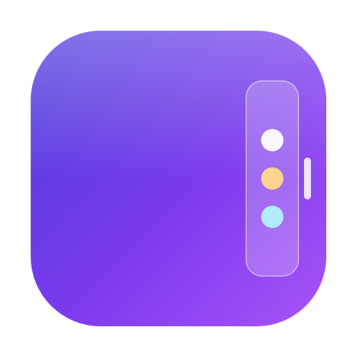
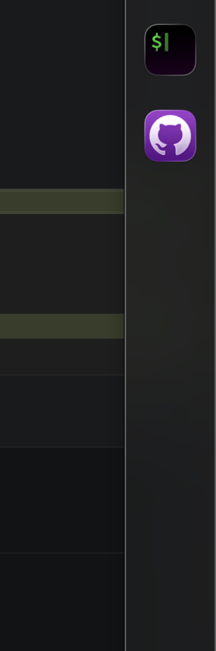
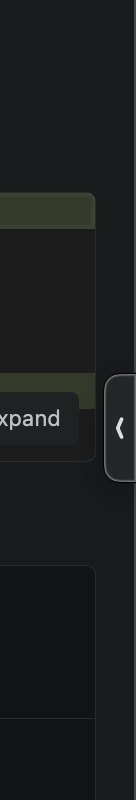

<div align="center">



# IyziPanel

**A glass edge-dock for macOS — your favorite apps, one hover away.**

A tiny handle lives on the right edge of your screen. Hover it and a frosted-glass
bar slides out with your most-used apps. Click to launch. Move the mouse away and it
quietly hides again.

</div>

---

## Features

- 🪟 **Edge handle** — a small, unobtrusive grip pinned to the right edge, always within reach.
- 🌫️ **Glass bar** — real macOS vibrancy (`NSVisualEffectView`) that slides out on hover.
- 🖱️ **One-click launch** — click an icon to open the app.
- 🎯 **Per-app launch mode** — choose *Activate*, *New instance*, or *New window* (`--new-window`, great for VS Code and other Electron apps).
- ⚙️ **Settings** — pick from your installed apps and **drag to reorder** them.
- ↕️ **Adjustable handle position** — slide the handle up or down; it doesn't have to sit dead-center.
- 🧭 **Bar anchor** — decide whether the bar opens *above*, *centered on*, or *below* the handle.
- ⏱️ **Auto-hide** — the bar collapses a few seconds after the pointer leaves.
- 🚀 **Launch at login** — starts with your Mac by default; toggle it off any time.
- 🧊 **Stays out of the way** — runs as a menu-less agent, floats over every Space and full-screen app.

<div align="center">

&nbsp;&nbsp;&nbsp;

<br/>
<em>Expanded bar (left) and the collapsed handle (right).</em>
</div>

## Requirements

- macOS 14 (Sonoma) or later
- Xcode 16+ / Swift 6 toolchain (to build)

## Build & Run

```bash
git clone https://github.com/hltsenarslan/IyziPanel.git
cd IyziPanel
./build.sh
open build/IyziPanel.app
```

`build.sh` compiles a release binary, generates the app icon, assembles `IyziPanel.app`,
and code-signs it.

### Installing

For **Launch at Login** to register reliably, move the app into `/Applications`:

```bash
cp -R build/IyziPanel.app /Applications/
open /Applications/IyziPanel.app
```

Then enable **“Launch at login”** in **Settings → General**.

## Usage

1. On first launch, the **Settings** window opens automatically.
2. In the **Apps** tab, add apps from the installed list (`+`), drag to reorder, and pick each app's **launch mode**.
3. In the **General** tab, adjust **launch-at-login**, the **handle position**, and the **bar anchor**.
4. Hover the handle on the right edge to reveal the bar; click any icon to launch.

Your configuration is stored at:

```
~/Library/Application Support/IyziPanel/config.json
```

## How it works

| Concern            | Implementation |
|--------------------|----------------|
| Window            | A borderless, non-activating `NSPanel` floating over all Spaces |
| Reveal / hide     | The panel resizes & repositions between a small handle and the full bar |
| Glass             | SwiftUI `NSViewRepresentable` wrapping `NSVisualEffectView` |
| Installed apps    | Scans `/Applications`, `/System/Applications`, `~/Applications`, and Utilities |
| Launch            | `NSWorkspace.openApplication` (with `createsNewApplicationInstance`) |
| Login item        | `SMAppService.mainApp` (macOS 13+) |
| Persistence       | Codable JSON in Application Support |

## Project layout

```
Sources/IyziPanel/
├── main.swift              # NSApplication bootstrap (accessory app)
├── AppDelegate.swift
├── DockController.swift     # panel, positioning, reveal/hide, launch
├── DockBarView.swift        # SwiftUI bar + handle
├── AppStore.swift           # observable model + JSON persistence
├── AppItem.swift
├── InstalledApps.swift      # scans installed .app bundles
├── LoginItem.swift          # SMAppService wrapper
├── SettingsController.swift # settings window
├── SettingsView.swift       # tabbed settings UI
└── VisualEffectView.swift   # vibrancy bridge
scripts/generate_icon.swift  # renders the app icon
build.sh                     # build → icon → bundle → sign
```

## Notes

- Some apps (e.g. Safari, Finder, VS Code) are single-instance by design, so *New instance*
  just focuses the existing app. For those, use **New window** — it passes `--new-window`,
  which opens a fresh window in the running app (works great with VS Code).
- The bundled build is code-signed with a private distribution identity. To build your
  own, set `SIGN_ID` to a signing identity from `security find-identity -v -p codesigning`,
  or use `SIGN_ID="-"` for an ad-hoc signature.

## License

MIT — see [LICENSE](LICENSE).
